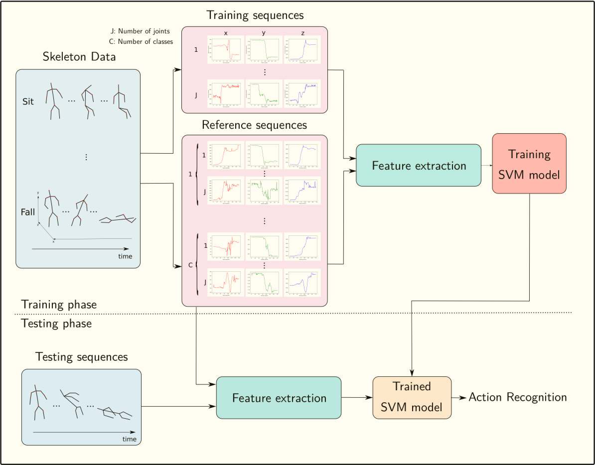

# A Novel DTW-Based Kernel for 3D Action Recognition with Robustness to Noise and Frame Loss

In this project, a novel DTW based method for classification of variable-length multi-dimensional time series of the skeletal joints position obtained by Kinect depth sensor is proposed. This method is based on our proposed kernel function that is calculated using the area generated by the DTW aligned path between two time series. To generate the feature vectors, one action is randomly chosen from each class as reference sample, and the proposed kernel function is calculated between a sample and the reference ones. One of the most important challenges of 3D action recognition is the various speed and styles of performing actions by different subjects. Also, the noisiness of time series and missing frames might make this task more difficult. Through various experiments, it is shown that the proposed method can effectively address these issues.

## Usage

Download the datasets from [here](https://drive.google.com/drive/folders/1n-OZ9Eq8Nf0-oi_6xThwzkbfUyKgwN9a?usp=sharing), put the in a folder named 'Dataset' and then follow these steps.

- Install required packages by running "pip install -r requirements.txt".

- Put all files in the same folder, then run the .py file corresponds to each dataset.

For additional experiments (frame loss, noise addition and t-SNE visualization) run the corresponding files.

## contact

If you have any question and comment, please don't hesitate to contact [Mohammad Akyash](mailto:mh_akyash@yahoo.com).
